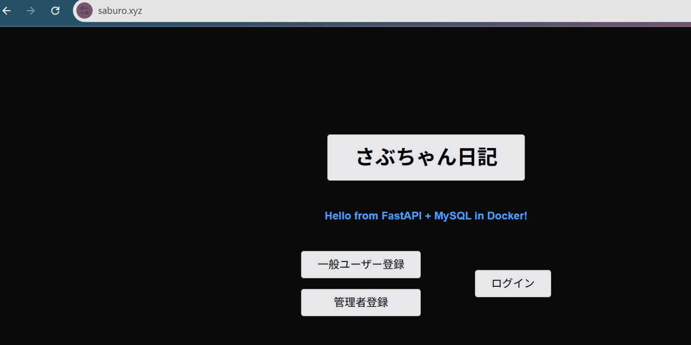
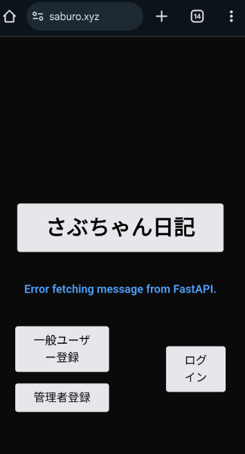

# 今日学んだこと

## 取り組んだ課題一覧
- ハッカソン（6h）
    - ミーティング(2h)
         - 各担当の進捗確認
         - AWSアーキテクチャ図の変更点を共有
         - CORSとは何かについて説明        
         - サブリーダーの変更      
         - SLA作成について（一旦は白紙になったが、簡易的なSLAを作成することになった）
    - backend(4h)
         - 機能実装(管理者機能の変更に伴い、APIエンドポイント追加/ models/admin.py, schemas/admin.pyを修正)→PR提出済み       
    - infra(2h)
         - 本番環境デプロイ（frontend+backend疎通確認のため）
         - **進捗(13:25時点)**
         - フロントエンドの https://saburo.xyz/ にアクセスしたところ、PCでは正常に "Hello from FastAPI + MySQL in Docker!" と表示されることを確認できた
         - 一方、スマホでは "Error fetching message from FastAPI." と表示されており、通信エラーが発生している状況
         - また、PCおよびスマホ両方で、https://api.saburo.xyz/ にアクセスし、期待通りのレスポンス（{"message":"Hello from FastAPI + MySQL in Docker!"}）が返ってきていることを確認       
         - **frontend側**
         - src/app/page.tsx 11行目の fetch(**"http://localhost:8000/"**) をfetch(**"https://api.saburo.xyz/"**) へ修正
         - S3やCloudFrontのリソースを再作成
         - S3ではパブリックアクセスをすべてブロックを"オフ"
         - CloudFrontがS3バケット（saburo-frontend）のオブジェクトにアクセスするために、バケットポリシーを追加し、必要な許可を与える
         - ビルドしたNext.js の静的ファイルをS3に手動でアップロード
         - CloudFrontのカスタム証明書として、ACMにてバージニア北部で作成したSSL証明書を適用
         - CloudFrontのデフォルトルートオブジェクトを"index.html"に設定
         - 代替ドメイン名（CNAMEs）は、メインドメインである"saburo.xyz"を設定
         - Route53にて、CloudFrontへ向けるエイリアスを設定するため、Aレコードを再作成（再作成したCloudFrontの
         ディストリビューション名で設定）

※ミーティングは学習時間に含めません。

## 現在発生している問題
- **ドメインアクセス時のレスポンスについて**（21:20頃）
    - 特定の一人がドメインにアクセスした場合は **"Hello from FastAPI + MySQL in Docker!"**と正常に表示されるが、他の複数のメンバーがアクセスすると **"Error fetching message from FastAPI."**とエラーが返される現象が発生している(13:25時点では問題はなかった)
    → backend側は問題なし。frontend側はでエラーが発生？CORS設定に問題がある？それ以外に原因がある？

## わかったこと
- 本番環境でスマホとPCで挙動が違う場合、frontend側の設定ミス（APIエンドポイントURLやCORS設定）が原因になりやすい
    - 特に今回、フロントのfetch("http://localhost:8000/")をfetch("https://api.saburo.xyz/")に修正していなかったことで、意図しないリクエスト先にアクセスしようとして失敗していた可能性が高い
    - しかし、上記を修正してもエラーが解消しなかったため、別の問題の可能性が考えられる
- 本番環境の構築・運用では、個別の技術要素（例：S3, CloudFront, Route53, ACM, ALBなど）を単独で理解しているだけでは不十分で、**「それらを組み合わせたシステム全体のつながり」**を俯瞰して理解しておくことが重要だとわかった
    - 特に、リソース間の依存関係（例：CloudFrontの証明書とRoute53の設定、S3のポリシーとCloudFrontオリジンアクセス）を適切に管理できないと、想定外のエラーに気づけない
- 環境トラブルは、単なる設定ミスだけでなく「認識のズレ」からも発生する
    - 特にチーム開発では、「誰が、どの環境（開発/ステージング/本番）を見て発言しているか」がズレると、問題の特定が遅れたり、無駄な検証作業が発生する

## 感じたこと
- **CORS**についてメンバーにうまく説明ができなかったので、言語化できるように復習が必要
- 複数のメンバーで複雑な構成で環境構築をすることは、連携自体難しい
- 変更された管理者機能に合わせるため、APIエンドポイントの設計と実装に予想以上の時間を要した
- backendとinfra担当を兼任することは結構大変だが、アプリケーションの理解なしにインフラ設計や環境構築はできないということを改めて実感し、結果として兼任して本当によかった

## 次やること
- backend
    - 管理者機能に変更が生じたため、API設計の修正をして最終版を完成させる（2025/04/29までにメンバーへ共有）
- infra
    - AWSアーキテクチャ図を修正する（2025/04/30までにメンバーへ共有）
         - RDSパラメータ設計を追加
         - 計画メンテナンスや一時的な障害が発生した際の対応を追加（それに伴い、S3も追加する）
    - prod-vpc(本番環境用のVPC)を使用して、本番環境を改めて0から構築する
    - CI/CDで自動デプロイで、想定通りのレスポンス **"Hello from FastAPI + MySQL in Docker!"**が返ってくるかを確認する
    - DB Migration用のタスク定義（Task Definition）が完成して、ECSに登録されたら、開発メンバーに報告する
         - RunTask起動用のLambda関数を作成しなければいけないため
    - Datadog APIキーをサイドカーコンテナに埋め込む(Datadogは2週間無料)

## 学習時間
- Today: 6h
- week : 6h
- Total: 48h 55m